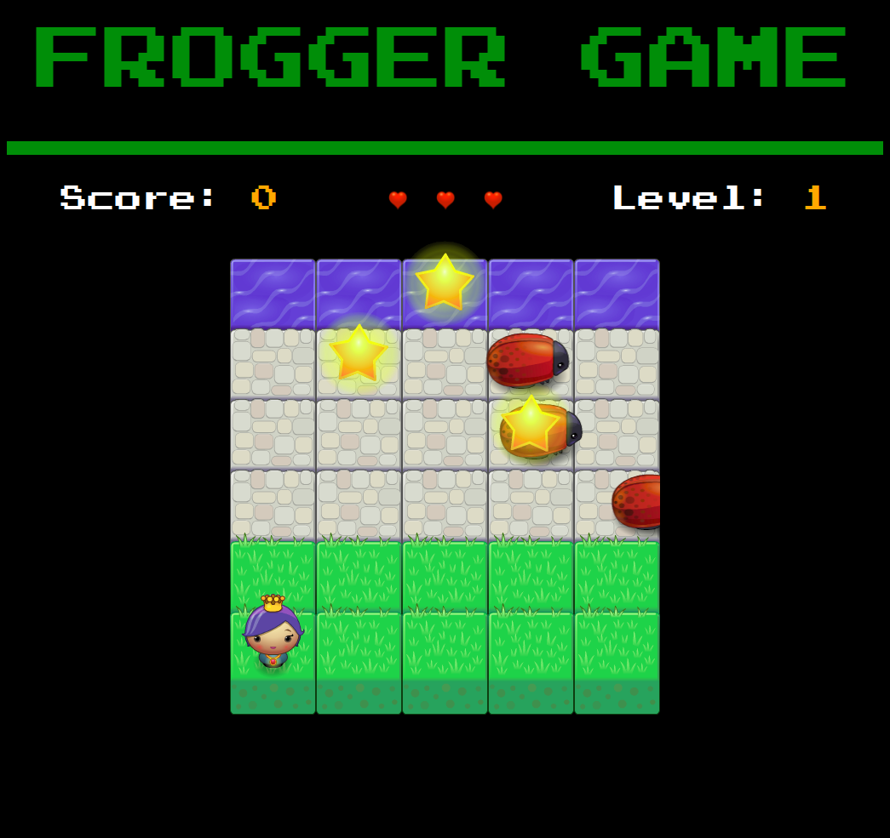

# Frogger Game


> Udacity Nanodegree - Front End Web Developer Project

This project is used to play the frogger game.

## Getting started

A quick introduction of the minimal setup you need to get up running this project.

```shell
cd fewd-arcade-game-master/
```

Open 'index.html' with your favourite web browser.

## Game Play

First you have to choose a player to start the game. The goal of the player is
to reach the water, without colliding into any one of the enemies. The player
can move left, right, up, down. The enemies move in varying speeds on the paved
block portion of the scene. Once the player collides with an enemy, the game is
reset and the player moves back to the start square. The game is over, if the
player looses all three lives.
While trying to reach the water, the player may collect some bonus points, if he
collects Stars (Level 1), Keys (Level 2) and Gems (Level 3).

See [Points](#points) section for more details.

### Screenshot



### Navigation

Use **arrow keys** or
*VIM-Navigation* keys (**h**=**left**, **j**=**down**, **k**=**up**, **l**=**right**)
to play the game.

### Difficulty

There are three levels.

| Difficulty | Enemies | Collectables          | Points to reach |
|------------|--------:|----------------------:|----------------:|
| Level 1    | 3       | 3xStars               | 0               |
| Level 2    | 4       | 3xStars, 1xKey        | 400             |
| Level 3    | 5       | 3xStars, 1xKey, 1xGem | 800             |

**Hint**: With each level the enemies are getting faster.

### Points

You can earn points if you reach the water and/or collect items.
If you hit an enemy you will loose points.

| Points | Place / Achievement    | Collectable |
|-------:|------------------------|-------------|
| -10    | hit Enemy              |             |
| 50     | reach Water            |             |
| 25     | on Water               | Gem         |
| 15     | paved Block            | Key         |
| 5      | anywhere on Game Board | Star        |

## Developing

### Built With

[HTML5](https://www.w3.org/TR/html5/)
[CSS3](https://www.w3.org/Style/CSS/)
[JavaScript](https://developer.mozilla.org/en-US/docs/Web/JavaScript)

### Prerequisites

In order to display 'index.html' you need a web browser.

### Setting up Dev

Clone the repository:

```shell
git clone https://github.com/volcain-io/fewd-arcade-game-master.git
cd fewd-arcade-game-master
```

Happy coding!

## Validation

The HTML and CSS Code is validated against the [W3C's Validators](http://validator.w3.org/).

## Style guide

The code style relies on [Udacity Style Guide](https://udacity.github.io/frontend-nanodegree-styleguide/).

## Licensing

[MIT License](LICENSE)
